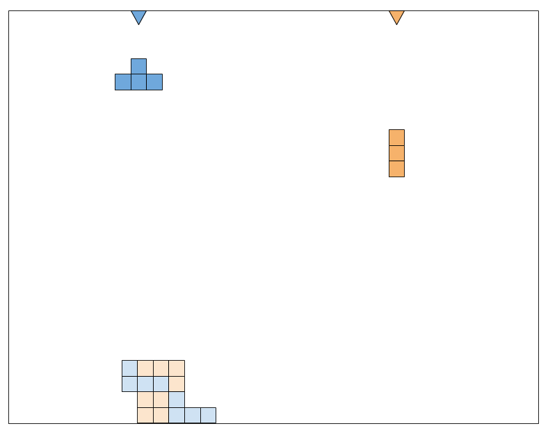

+++
author = "Thanish"
categories = ["js"]
date = 2020-12-12T17:30:00Z
description = ""
draft = false
slug = "multiplayer-tetris-game"
tags = ["js"]
title = "Multiplayer Tetris Game"

+++

# Multiplayer Tetris Game

I just wanted to see what it would look like if multiple players try to play Tetris on the same canvas. Let's build this game in multiple rounds where the result of each iteration is a playable game.

These are our requirements for version 1:

- it should be possible for multiple players to play the game
- it should support all the basic rules of a "Tetris" like game

This is what we're NOT doing for version 1:

- avoid support for playing with multiple devices, create a split-screen multiplayer game
- avoid support for mobile devices, touch controls, etc.

## Basic Components

Before building, let's list down all the basic components. If we get this good enough, it may survive this version and some future versions of this game.

I guess that's enough to get us started.
